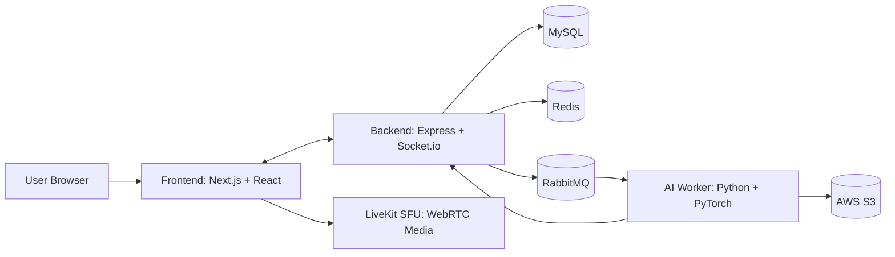

<p align="center">
  
</p>

<h1 align="center">KERO</h1>

<p align="center">
  <strong>AI 기반 실시간 온라인 노래방 플랫폼</strong><br/>
  <sub>WebRTC 실시간 통신과 AI 음원 분석을 결합한 멀티 유저 노래방 서비스</sub>
</p>

<p align="center">
  <a href="https://kero.ooo">
    
  </a>
</p>

<p align="center">
  
  
  
  
  
  
  
  
</p>

<p align="center">
  
  
  
  
</p>

---

## 🏷 배지/아이콘

### 서비스 배지

<p align="left">
  
  
  
  
  
</p>

### 기술 스택 배지

<p align="left">
  
  
  
  
  
  
  
  
</p>

## 📖 프로젝트 배경

온라인 노래방 서비스는 보통 "함께 부르는 실시간성"과 "게임처럼 즐기는 상호작용"이 약합니다.  
KERO는 아래 3가지를 핵심 목표로 설계되었습니다.

1. 오프라인 노래방에 가까운 몰입형 실시간 경험 구현
2. 실시간 통신과 AI 분석(보컬 분리, 가사 싱크, 음정 점수화) 결합
3. 퀴즈/점수 모드를 통한 참여형 콘텐츠 확장

## ✨ 차별화 포인트

- **AI 보컬 분리**: Mel-Band Roformer 기반으로 원곡에서 보컬/MR 분리
- **AI 음정 점수화**: FCPE 기반 Pitch Contour 분석으로 실시간 점수 산출
- **실시간 가사 싱크**: SOFA 기반 정렬 데이터로 단어 단위 하이라이트
- **게임화 모드**: 일반/퍼펙트 스코어/노래 퀴즈 3개 모드 제공

## 🎯 핵심 기능

### 1) 실시간 온라인 노래방
- LiveKit(WebRTC SFU) + Socket.io로 저지연 동기화
- 최대 6명 동시 참여
- 호스트 중심 재생 제어(큐/상태 동기화)

### 2) AI 음정 분석 (Perfect Score)
- FCPE 모델로 사용자 음정 추출
- 기준 음정 대비 정확도 계산 및 점수화

### 3) 보컬/반주 분리
- Mel-Band Roformer 기반 고품질 분리
- 노래방용 MR 환경 구성

### 4) 가사 자동 정렬 및 싱크
- SOFA(Singing-Oriented Forced Aligner) 활용
- 단어/구간 단위 타임스탬프 정렬

### 5) 노래 퀴즈 모드
- 제목/가수/가사/초성 등 다양한 문제 유형
- 실시간 정답 경쟁 + 점수 집계

## 🏗 시스템 아키텍처



## 🛠 기술 스택

### Frontend
| 아이콘 | 기술 | 용도 |
|------|------|------|
|   | Next.js 15 / React 19 | 웹 애플리케이션 UI |
|  | TypeScript | 타입 안전성 |
|  | Tailwind CSS | 스타일링 |
|  | Redux Toolkit | 상태 관리 |
|  | Socket.io Client | 실시간 이벤트 수신 |
|  | LiveKit Client | WebRTC 미디어 송수신 |
|    | Framer Motion / GSAP / Spline | 인터랙션 및 3D 표현 |

### Backend
| 아이콘 | 기술 | 용도 |
|------|------|------|
|  | Express.js | REST API |
|  | Socket.io | 실시간 게임/방 상태 동기화 |
|   | TypeORM + MySQL | 데이터 영속화 |
|  | Redis | 캐시/온라인 상태/실시간 보조 |
|  | RabbitMQ | AI 작업 큐 |
|  | LiveKit Server SDK | 토큰 발급 및 세션 연동 |
|  | AWS S3 | 오디오 파일 저장 |

### AI Worker
| 아이콘 | 기술 | 용도 |
|------|------|------|
|  | Python 3.12 | 런타임 |
|   | PyTorch + CUDA | GPU 추론 |
|  | Mel-Band Roformer | 보컬 분리 |
|  | SOFA | 가사 정렬 |
|  | FCPE | 음정 추출 |
|  | WhisperX / Faster-Whisper | 음성 인식 보조 |
|  | yt-dlp | 음원 수집 파이프라인 보조 |

### Infra
| 아이콘 | 기술 | 용도 |
|------|------|------|
|  | Docker Compose | 서비스 오케스트레이션 |
|  | Nginx | 리버스 프록시 / HTTPS |
|  | LiveKit Server | 실시간 미디어 서버 |
|  | Jenkins | CI/CD 자동화 |
|   | AWS EC2 + S3 | 배포/스토리지 |
|    | ELK Stack | 로그 수집/관측 |

## 📁 프로젝트 구조

```text
.
├── frontend/            # Next.js 클라이언트
├── backend/             # Express + Socket.io 서버
├── ai-worker/           # Python AI 비동기 처리 워커
├── docker-compose.yml   # 코어 인프라/앱 구성
├── livekit/             # LiveKit 설정
├── nginx/               # Nginx 설정
├── rabbitmq/            # RabbitMQ 설정
├── elk/                 # Elasticsearch/Logstash/Kibana
└── Jenkinsfile          # CI/CD 파이프라인
```

## 📆 개발 기간

- 총 4주 스프린트 기반 개발
- 1주차: 요구사항/화면/DB 설계
- 2주차: 룸 생성/참여, WebRTC 다중 접속 구현
- 3주차: 노래방 핵심 기능 + 실시간 안정화
- 4주차: 통합 테스트, UX 개선, 배포 및 발표 준비

## 🚀 실행 가이드

### 1) 환경변수 준비

```bash
cp .env.example .env
cp backend/.env.example backend/.env
cp ai-worker/.env.example ai-worker/.env
```

### 2) Docker 실행 (권장)

```bash
# 루트 서비스 실행
docker compose up -d --build

# AI 워커 실행 (GPU 환경)
cd ai-worker
docker compose up -d --build
```

### 3) 로컬 개발 실행

```bash
# backend
cd backend
npm install
npm run dev

# frontend
cd frontend
npm install
npm run dev
```

> AI 워커는 CUDA/GPU 의존성이 있어 Docker 환경에서 실행을 권장합니다.

## 🔌 주요 API

| 경로 | 설명 |
|------|------|
| `/api/auth` | 회원가입/로그인/프로필 관련 |
| `/api/rooms` | 방 생성/조회/참여/삭제 |
| `/api/songs` | 곡 처리/상태 조회/퀴즈 관련 |
| `/api/search` | TJ/YouTube 기반 검색 |
| `/api/livekit/token` | LiveKit 접속 토큰 발급 |
| `/api/health` | 서버 헬스체크 |

## 🧩 트러블슈팅 하이라이트

- STT/가사 정렬 품질 개선: Whisper -> Faster-Whisper -> SOFA 중심 파이프라인으로 고도화
- 보컬 분리 모델 개선: Demucs/기존 모델 비교 후 Mel-Band Roformer 채택
- 음정 분석 최적화: CREPE 대비 FCPE로 속도/성능 개선
- 배포 이슈 대응: Jenkins/GPU/RabbitMQ 설정 이슈를 파이프라인과 환경 변수 정비로 해결

## 👥 팀 구성

| 이름 | 역할 |
|------|------|
| 윤희준 | Full-stack / 시스템 총괄 |
| 김관익 | Backend / 사용자 관리 |
| 김성민 | Frontend / 이벤트 처리 |
| 박찬진 | Backend / 데이터 및 서버 관리 |
| 윤희망 | Frontend / 실시간 기능 |
| 정훈호 | Backend / 실시간 처리 |
